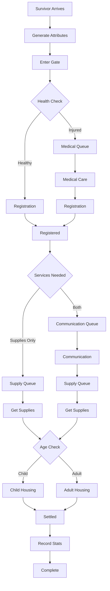

```mermaid
graph TD
    A[Survivor Arrives] --> B[Generate Attributes]
    B --> C[Enter Gate]
    C --> D{Health Check}
    D -->|Injured| E[Medical Queue]
    D -->|Healthy| F[Registration]
    E --> G[Medical Care]
    G --> H[Registration]
    F --> I[Registered]
    H --> I
    I --> J{Services Needed}
    J -->|Supplies Only| K[Supply Queue]
    J -->|Both| L[Communication Queue]
    K --> M[Get Supplies]
    L --> N[Communication]
    N --> O[Supply Queue]
    O --> P[Get Supplies]
    M --> Q{Age Check}
    P --> Q
    Q -->|Child| R[Child Housing]
    Q -->|Adult| S[Adult Housing]
    R --> T[Settled]
    S --> T
    T --> U[Record Stats]
    U --> V[Complete]
```
