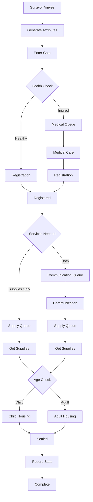

# Requirements for the Simulation

- **Conceptual Model**  
  - At least 4 different service points  
  - Service point network cannot be a straight line  
  - Several paths through the system  

- **Distributions**  
  - Possible to change distributions  
  - Possible to modify parameters as inputs  

- **User Interface (JavaFX)**  
  - Graphical interface for inputs and outputs  
  - Simulation run can be visualized or animated  
  - Interface suitable for general use (fonts, colors, usability)  

- **Simulation Control**  
  - Operates autonomously once started  
  - User can influence during runtime:  
    - Slow down  
    - Speed up  
    - Step through execution  

- **Data Repositories**  
  - File-based solution  
  - Database solution  

- **Added Value**  
  - Implementation of variability  

